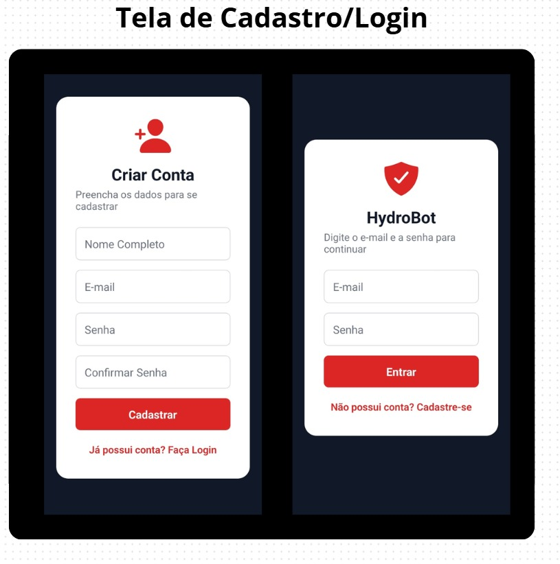
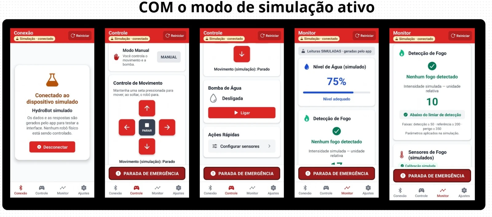
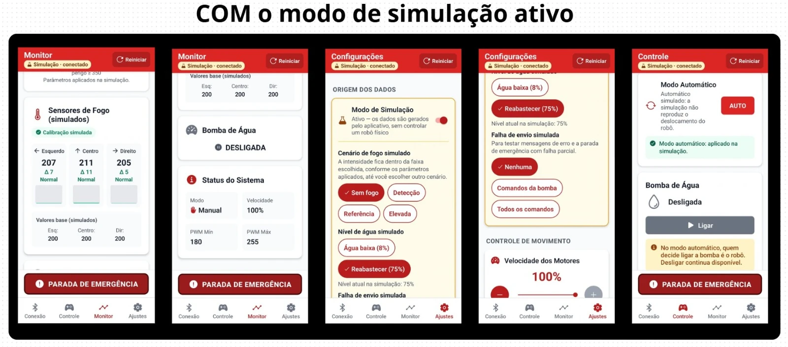
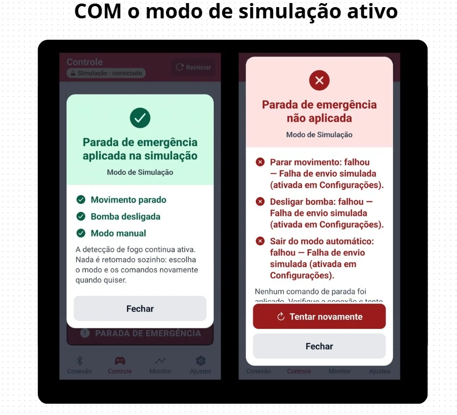

# HydroBot V3 — Aplicativo móvel

Aplicativo móvel do **HydroBot**, plataforma robótica para combate inicial a incêndios em ambientes internos, desenvolvido no **Projeto Integrador I** do curso de Tecnologia em Análise e Desenvolvimento de Sistemas da **FATEC Bauru** (2026).

O aplicativo reúne autenticação local, conexão, controle, monitoramento, configurações e parada de emergência. Nesta etapa, ele foi avaliado no **Modo de Simulação**, sem o robô físico. Por acordo com o professor, a fabricação, a integração e os ensaios do hardware V3 são uma etapa futura.

> **Versão documentada:** branch [`ihc-v3-ajustes`](https://github.com/YagoHM/HydroBot-App-Bluetooth/tree/ihc-v3-ajustes). A branch `master` contém uma versão anterior do aplicativo, sem os ajustes descritos aqui. Para obter esta versão:
>
> ```bash
> git clone -b ihc-v3-ajustes https://github.com/YagoHM/HydroBot-App-Bluetooth.git
> ```

- Site do projeto: <https://hydrobot-six.vercel.app/>
- Relatório técnico do estado atual do app: [`RELATORIO_ATUAL_APP_HYDROBOT.md`](RELATORIO_ATUAL_APP_HYDROBOT.md)

---

## Sumário

- [Tecnologias](#tecnologias)
- [Funcionalidades atuais](#funcionalidades-atuais)
- [Galeria de telas](#galeria-de-telas)
- [Como executar](#como-executar)
- [Roteiro para experimentar a simulação](#roteiro-para-experimentar-a-simulação)
- [Estrutura do projeto](#estrutura-do-projeto)
- [Testes e verificações](#testes-e-verificações)
- [Estado de desenvolvimento](#estado-de-desenvolvimento)
- [Limitações e próximos passos](#limitações-e-próximos-passos)
- [Documentação](#documentação)

---

## Tecnologias

| Tecnologia | Versão | Uso |
| --- | --- | --- |
| React Native | 0.81.5 (nova arquitetura) | Interface nativa |
| TypeScript | 5.9 (modo estrito) | Linguagem |
| Expo | SDK 54 | Ferramentas de build e módulos nativos |
| Expo Router | 6 | Navegação por arquivos (pilha e abas) |
| react-native-ble-plx | 3.5.0 | Comunicação **Bluetooth Low Energy (BLE)** |
| AsyncStorage | 2.2.0 | Persistência local |
| @react-native-community/slider | 5.0.1 | Ajustes de velocidade e PWM |
| react-native-web | 0.21 | Versão web (somente simulação) |

O estado global usa Context API (`AuthContext` e `BluetoothContext`) e hooks. O app **não** usa Flutter nem Dart.

---

## Funcionalidades atuais

| Tela | O que oferece |
| --- | --- |
| **Login** | Entrada com e-mail e senha, validação do formato do e-mail, mensagens de erro em modal |
| **Cadastro** | Nome, e-mail, senha e confirmação; exige todos os campos, e-mail válido e senhas iguais |
| **Conexão** | Busca de dispositivos, conexão e desconexão; identifica o dispositivo simulado e, no BLE, se há indício de compatibilidade com o HydroBot |
| **Controle** | Modo **MANUAL/AUTO**; setas de movimento (pressionar move, soltar para) e botão PARAR; **controle de uma bomba** (ligar é bloqueado com água ≤ 10% ou no modo automático; desligar sempre disponível) |
| **Monitor** | Nível de água, detecção de fogo com intensidade em unidade relativa, três sensores de fogo, estado e PWM da bomba, modo, velocidade e PWM; avisos de “sem leitura” e de dados desatualizados |
| **Configurações** (aba **Ajustes**) | Modo de Simulação; cenários de fogo, nível de água e falha de envio simulados; velocidade (30–100%); PWM mínimo e máximo; limiar, referência e perigo de fogo, com validação; Sobre e Ajuda |
| **Parada de emergência** | Botão fixo em Controle e Monitor. O toque envia imediatamente parar movimento, desligar bomba e sair do modo automático. Um modal mostra o resultado de cada ação e permite tentar de novo em caso de falha. Fechar o modal não retoma nada |

**Recursos de interface:**

- Indicador de modo e conexão no cabeçalho (ex.: “Simulação · conectado”).
- Feedback que diferencia comando aplicado na simulação, enviado, confirmado pelo dispositivo e com falha.
- Modais padronizados com controle de foco.
- Rótulos acessíveis para leitor de tela.
- Ajustes para fonte ampliada e para o teclado.
- Respeito às áreas seguras do Android.

### Modo de Simulação

Ativo por padrão: o app conecta sozinho a um **dispositivo simulado** e gera dados de água, fogo, sensores, bomba e movimento, atualizados a cada 600 ms. Ele permite usar e avaliar todas as telas **sem o robô**.

Os valores da simulação (intensidade de fogo, PWM, velocidade, nível de água) são **relativos**: não têm unidade física nem calibração. O **modo automático** é apenas um estado de software; o app não executa navegação autônoma nem combate a incêndio.

### Bluetooth (BLE)

A camada de comunicação BLE foi implementada com `react-native-ble-plx`, usando o serviço UART da Nordic: busca, conexão com verificação do serviço, envio de comandos em texto e recepção de telemetria. **A integração com o hardware HydroBot V3 ainda não foi validada.** Uma escrita BLE concluída não comprova que o robô executou a ação; por isso, o app só mostra “confirmado” quando o dispositivo responde.

### Autenticação

É **local e experimental**: as contas ficam salvas apenas no próprio aparelho (no navegador, na versão web), com a **senha em texto puro**, sem servidor. A sessão não é mantida ao fechar ou recarregar o app, e não há botão “Sair”. Não use senhas reais.

---

## Galeria de telas

Capturas de 7 de outubro de 2026, feitas no Android com o **Modo de Simulação ativo**: todos os dados exibidos são simulados.

### Cadastro e Login



*Cadastro (“Criar Conta”) e Login. As contas são locais ao aparelho.*

### Conexão, Controle e Monitor em simulação



*Conexão com o “HydroBot simulado”, Controle no modo manual e Monitor com leituras simuladas. O cabeçalho indica “Simulação · conectado”.*

### Monitor, Configurações e modo automático



*Sensores e status no Monitor, opções do Modo de Simulação em Configurações e Controle no modo automático, em que ligar a bomba fica bloqueado e desligar continua disponível.*

### Parada de emergência: sucesso e falha



*Resultado da parada de emergência na simulação: sucesso e falha total causada pela opção “Falha de envio simulada”. Na versão atual da branch, quando todas as ações falham pela mesma causa, a causa aparece uma única vez, seguida da lista de ações não enviadas.*

---

## Como executar

### Pré-requisitos

- [Node.js](https://nodejs.org/) 22 (verificado com 22.19; o comando `npm test` exige o suporte a TypeScript do Node 22).
- npm.
- Para o Android: uma **build nativa** do app, pois o módulo BLE (`react-native-ble-plx`) não faz parte do **Expo Go**. A execução no Expo Go não foi verificada.

### Instalação

```bash
npm install
```

### Web (somente Modo de Simulação)

```bash
npm run web
```

A versão web serve para conhecer a interface. Ela usa sempre a simulação, porque a conexão física não está disponível no navegador. Recursos nativos (TalkBack, teclado virtual, botão Voltar, Bluetooth) não são representados.

### Android

Com Android SDK e JDK configurados, gere e instale uma build de desenvolvimento:

```bash
npm run android
```

Ou gere um APK pelo EAS. Esse caminho requer a EAS CLI e acesso à conta Expo do projeto configurado no `app.json`:

```bash
eas build --platform android --profile preview
```

O `eas.json` também define os perfis `development` (dev client) e `production`. Nenhum link de APK é distribuído neste repositório.

---

## Roteiro para experimentar a simulação

1. Abra o app (web ou Android) e toque em **Não possui conta? Cadastre-se**. Crie uma conta com dados fictícios e entre com ela.
2. Na aba **Conexão**, confirme “Conectado ao dispositivo simulado” e o indicador **Simulação · conectado** no cabeçalho.
3. Em **Monitor**, veja as leituras simuladas: água, fogo, sensores, bomba e status.
4. Em **Ajustes**, escolha o cenário de fogo **Elevada** e volte ao Monitor; depois escolha **Sem fogo**.
5. Em **Ajustes**, toque em **Água baixa (8%)**. Em **Controle**, veja que ligar a bomba fica bloqueado. Depois toque em **Reabastecer (75%)**.
6. Em **Controle**, mantenha uma seta pressionada (o movimento simulado muda) e solte (para). Ligue a bomba e mude para **AUTO**.
7. Toque em **PARADA DE EMERGÊNCIA**: o modal mostra movimento parado, bomba desligada e modo manual.
8. Em **Ajustes → Falha de envio simulada**, escolha **Comandos da bomba** ou **Todos os comandos** e repita a emergência para ver a falha parcial ou total e o botão **Tentar novamente**.
9. Em **Ajustes**, altere o Limiar de Detecção (ex.: 40) e toque em **Aplicar**. Teste também valores inválidos, como `20abc` ou `250`, para ver as mensagens de validação.

---

## Estrutura do projeto

```
app/                   Telas e rotas (Expo Router)
  _layout.tsx          Raiz: tratamento de erros, autenticação e Bluetooth
  login.tsx            Login
  register.tsx         Cadastro
  (tabs)/              Abas: index (Conexão), control, monitor, settings (Ajustes)
components/            Modais, parada de emergência, indicador do cabeçalho, campos e sliders
context/               AuthContext (contas locais) e BluetoothContext (modo, conexão, comandos, emergência)
services/              Protocolo e transporte BLE, simulador, telemetria, faixas de fogo, emergência
hooks/                 Feedback de comandos, leitor de tela e altura do teclado
utils/                 Validação e cálculos de layout
plugins/               Config plugin Expo para atualização do layout ao mudar a fonte do Android
tests/                 Testes automatizados (node:test)
scripts/verificacao-web/  Roteiro de verificação da versão web em simulação
docs/                  Imagens, evidências de verificação e documentação de IHC
```

---

## Testes e verificações

| Comando | O que verifica |
| --- | --- |
| `npx tsc --noEmit` | Tipos TypeScript |
| `npm run lint` | Regras do ESLint (`eslint-config-expo`) |
| `npm test` | 33 testes de lógica: simulador, validação, emergência, layout/teclado e classificação de compatibilidade BLE |
| `npx expo-doctor` | Diagnóstico do projeto Expo |
| `npm run build:web` | Build web de produção em `dist/` |

Execução do roteiro web com asserções (com o servidor rodando, execute o `verify.mjs` em outro terminal; o script usa o Google Chrome, e outro caminho pode ser informado em `CHROME_PATH`):

```bash
node scripts/verificacao-web/serve.mjs dist 8090
node scripts/verificacao-web/verify.mjs saida-verificacao http://localhost:8090
```

**Resultados registrados** em 7 de outubro de 2026 (commit `eec281b`):

| Verificação | Resultado |
| --- | --- |
| `tsc` e lint | Sem erros nem avisos |
| `npm test` | 33/33 aprovados |
| `expo-doctor` | 18/18 checagens aprovadas |
| Roteiro web em simulação | 66 critérios aprovados |

Detalhes no [relatório técnico](RELATORIO_ATUAL_APP_HYDROBOT.md).

**Testes manuais no Android:** a equipe relatou testes do app instalado no Android em **Modo de Simulação**, incluindo TalkBack, fontes ampliadas, botões de navegação do sistema e os fluxos do aplicativo. Aparelho, versão do Android e build utilizada não foram registrados. Esses testes não envolveram o robô físico.

---

## Estado de desenvolvimento

- **IMPLEMENTADO** — existe no código e na interface.
- **SIMULADO** — representado por dados gerados em software, sem o fenômeno físico.
- **PROJETADO** — definido na arquitetura ou na modelagem, ainda não implementado.
- **FUTURO** — integração ou validação ainda a executar.

| Recurso | Estado |
| --- | --- |
| Telas, navegação, Login e Cadastro locais | IMPLEMENTADO |
| Modo de Simulação (água, fogo, sensores, bomba, movimento) | IMPLEMENTADO como recurso de teste; dados SIMULADOS |
| Controle de movimento e de uma bomba | IMPLEMENTADO na interface; efeito SIMULADO; atuação física FUTURA |
| Parada de emergência | IMPLEMENTADO na interface; resultado SIMULADO; parada física FUTURA |
| Monitoramento e telemetria | IMPLEMENTADO na interface; leituras SIMULADAS; sensores reais FUTUROS |
| Modo automático | IMPLEMENTADO como estado de software; navegação autônoma FUTURA |
| Comunicação BLE | IMPLEMENTADO no código; validação com o hardware V3 FUTURA |
| Calibração dos sensores pelo app | PROJETADO no protocolo; não disponível na interface |
| Três circuitos hidráulicos, torre, mapa, vídeo e câmera térmica | PROJETADO na arquitetura V3; FUTURO no app e no robô |
| Fabricação, integração física e ensaios do robô V3 | FUTURO |

---

## Limitações e próximos passos

**Limitações atuais:**

- A comunicação BLE não foi validada com o robô; o significado físico, as unidades e as faixas dos parâmetros dependem do contrato de integração ainda não definido.
- A simulação não representa trajetória, consumo de água, imagem térmica nem comportamento do firmware.
- A autenticação é de protótipo: senha em texto puro, sem servidor, sem sessão persistente e sem logout.
- O app controla uma bomba; os três circuitos hidráulicos previstos na V3 não estão na interface.
- Não há build nem testes em iOS.

**Próximos passos:**

- Definir o contrato de comandos e telemetria com o hardware: unidades, faixas, confirmações e erros.
- Fabricar e integrar o robô V3 e validar a comunicação BLE com ele.
- Expandir o app para torre, três circuitos hidráulicos, mapa e vídeo, conforme o hardware for disponibilizado.
- Revisar a autenticação antes de qualquer uso com dados reais.

---

## Documentação

| Documento | Conteúdo |
| --- | --- |
| [`RELATORIO_ATUAL_APP_HYDROBOT.md`](RELATORIO_ATUAL_APP_HYDROBOT.md) | Estado atual do aplicativo: arquitetura, telas, simulação, BLE, autenticação, verificações e limitações |
| [`RELATORIO_ALTERACOES_IHC_HYDROBOT.md`](RELATORIO_ALTERACOES_IHC_HYDROBOT.md) | Histórico dos ajustes de interface e das verificações de cada versão |
| [`docs/IHC-V3-ajustes.md`](docs/IHC-V3-ajustes.md) | Detalhamento por arquivo dos ajustes de interface (versão `f103d1a`) |
| [`docs/evidencias/verificacao/`](docs/evidencias/verificacao/) | Capturas e saídas do roteiro de verificação web |
| [Site do projeto](https://hydrobot-six.vercel.app/) | Apresentação do HydroBot |

**Relação com IHC:** a disciplina de Interação Humano-Computador avaliou a interface do aplicativo, e essas avaliações orientaram os refinamentos documentados nos relatórios de IHC. Elas são uma atividade acadêmica separada e complementar ao Projeto Integrador I.

O repositório não contém arquivo de licença.
